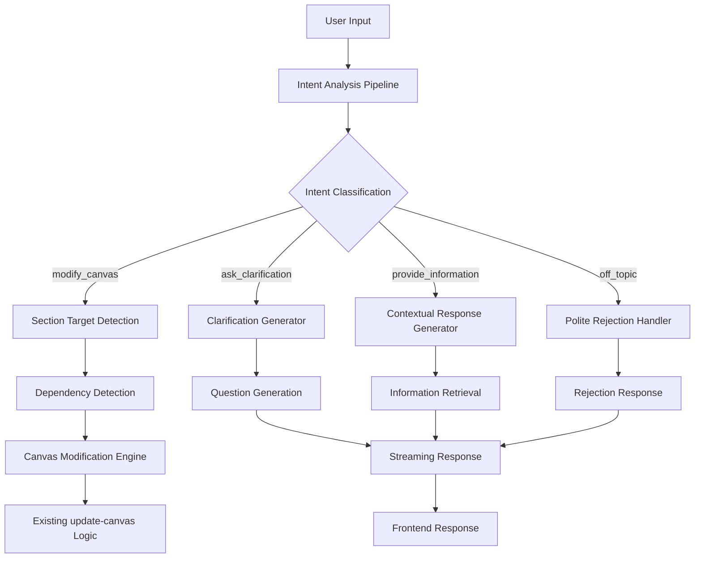
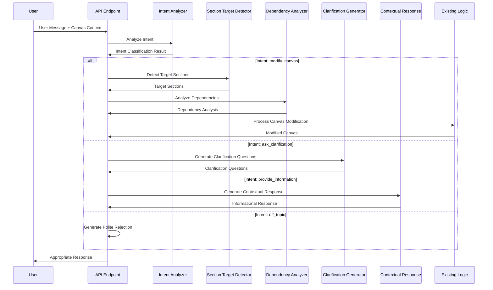

# Design Document

## Overview

El Sistema de Análisis de Intención Inteligente es una capa de procesamiento que se integra con los endpoints existentes `generate-suggestions` y `update-canvas` para proporcionar capacidades de análisis contextual avanzado. El sistema utiliza un enfoque de pipeline de procesamiento multi-etapa que analiza la intención del usuario, identifica secciones objetivo, detecta dependencias, y determina la acción apropiada (modificar, preguntar, informar, o rechazar).

La arquitectura sigue un patrón de "Intelligent Middleware" donde el análisis de intención actúa como una capa de decisión entre la entrada del usuario y la lógica de procesamiento existente, manteniendo compatibilidad completa con el sistema actual mientras añade capacidades inteligentes.

## Architecture

### System Architecture Overview



### Intent Analysis Pipeline Architecture

El pipeline de análisis de intención consta de 4 etapas principales:

1. **Intent Classification Stage**: Determina la intención primaria del usuario
2. **Context Analysis Stage**: Analiza el contexto del ticket y lienzo actual
3. **Action Decision Stage**: Decide qué acción tomar basándose en la intención y contexto
4. **Response Generation Stage**: Genera la respuesta apropiada según la decisión

### Integration Architecture

```mermaid
graph LR
    A[Chrome Extension] --> B[/api/update-canvas]
    A --> C[/api/generate-suggestions]
    
    B --> D[Intent Analysis Middleware]
    C --> D
    
    D --> E[Existing Canvas Logic]
    D --> F[Clarification Handler]
    D --> G[Information Handler]
    D --> H[Rejection Handler]
    
    E --> I[Modified Canvas Response]
    F --> J[Clarification Questions]
    G --> K[Contextual Information]
    H --> L[Polite Rejection]
```

## Components and Interfaces

### Core Components

#### 1. IntentAnalyzer

**Purpose**: Clasificación principal de intenciones del usuario
**Location**: `src/lib/ai/intentAnalyzer.ts`

```typescript
interface IntentAnalyzer {
  analyzeIntent(
    userMessage: string,
    conversationHistory: UIMessage[],
    currentCanvas: QACanvasDocument
  ): Promise<IntentAnalysisResult>
}

interface IntentAnalysisResult {
  intent: IntentType
  confidence: number
  targetSections: CanvasSection[]
  context: AnalysisContext
  reasoning: string
}

type IntentType = 
  | 'modify_canvas'
  | 'ask_clarification' 
  | 'provide_information'
  | 'request_explanation'
  | 'off_topic'

type CanvasSection = 
  | 'ticketSummary'
  | 'acceptanceCriteria'
  | 'testCases'
  | 'configurationWarnings'
  | 'metadata'
```

#### 2. SectionTargetDetector

**Purpose**: Identificación de secciones específicas del lienzo a modificar
**Location**: `src/lib/ai/sectionTargetDetector.ts`

```typescript
interface SectionTargetDetector {
  detectTargetSections(
    userMessage: string,
    currentCanvas: QACanvasDocument
  ): Promise<SectionTargetResult>
}

interface SectionTargetResult {
  primaryTargets: CanvasSection[]
  secondaryTargets: CanvasSection[]
  keywords: string[]
  confidence: number
}
```

#### 3. DependencyAnalyzer

**Purpose**: Detección de dependencias entre secciones del lienzo
**Location**: `src/lib/ai/dependencyAnalyzer.ts`

```typescript
interface DependencyAnalyzer {
  analyzeDependencies(
    targetSections: CanvasSection[],
    currentCanvas: QACanvasDocument,
    proposedChanges: string
  ): Promise<DependencyAnalysisResult>
}

interface DependencyAnalysisResult {
  affectedSections: CanvasSection[]
  dependencies: SectionDependency[]
  cascadeRequired: boolean
  impactAssessment: string
}

interface SectionDependency {
  from: CanvasSection
  to: CanvasSection
  relationship: 'derives_from' | 'validates' | 'implements' | 'references'
  strength: 'strong' | 'medium' | 'weak'
}
```

#### 4. ClarificationGenerator

**Purpose**: Generación de preguntas de clarificación específicas
**Location**: `src/lib/ai/clarificationGenerator.ts`

```typescript
interface ClarificationGenerator {
  generateClarificationQuestions(
    userMessage: string,
    targetSections: CanvasSection[],
    currentCanvas: QACanvasDocument
  ): Promise<ClarificationResult>
}

interface ClarificationResult {
  questions: ClarificationQuestion[]
  context: string
  suggestedActions: string[]
}

interface ClarificationQuestion {
  question: string
  category: 'specification' | 'scope' | 'priority' | 'format' | 'dependency'
  targetSection: CanvasSection
  examples?: string[]
}
```

#### 5. ContextualResponseGenerator

**Purpose**: Generación de respuestas informativas sin modificar el lienzo
**Location**: `src/lib/ai/contextualResponseGenerator.ts`

```typescript
interface ContextualResponseGenerator {
  generateContextualResponse(
    userMessage: string,
    currentCanvas: QACanvasDocument,
    originalTicket: JiraTicket
  ): Promise<ContextualResponse>
}

interface ContextualResponse {
  response: string
  relevantSections: CanvasSection[]
  citations: ContentCitation[]
  suggestedFollowUps: string[]
}

interface ContentCitation {
  section: CanvasSection
  content: string
  relevance: 'high' | 'medium' | 'low'
}
```

### AI Tools and Prompts

#### Intent Classification Tool

```typescript
const intentClassificationTool = tool({
  description: "Classify user intent for QA canvas interactions",
  parameters: z.object({
    intent: z.enum([
      'modify_canvas',
      'ask_clarification', 
      'provide_information',
      'request_explanation',
      'off_topic'
    ]),
    confidence: z.number().min(0).max(1),
    targetSections: z.array(z.enum([
      'ticketSummary',
      'acceptanceCriteria', 
      'testCases',
      'configurationWarnings'
    ])),
    reasoning: z.string().describe("Explanation of classification decision"),
    keywords: z.array(z.string()).describe("Key terms that influenced classification")
  })
})
```

#### Dependency Analysis Tool

```typescript
const dependencyAnalysisTool = tool({
  description: "Analyze dependencies between canvas sections",
  parameters: z.object({
    affectedSections: z.array(z.enum([
      'ticketSummary',
      'acceptanceCriteria',
      'testCases'
    ])),
    dependencies: z.array(z.object({
      from: z.string(),
      to: z.string(),
      relationship: z.enum(['derives_from', 'validates', 'implements', 'references']),
      strength: z.enum(['strong', 'medium', 'weak'])
    })),
    cascadeRequired: z.boolean(),
    impactAssessment: z.string()
  })
})
```

## Data Models

### Enhanced Message Processing Pipeline



### Conversation State Management

```typescript
interface ConversationState {
  sessionId: string
  currentPhase: ConversationPhase
  pendingClarifications: ClarificationQuestion[]
  lastIntent: IntentAnalysisResult
  contextHistory: ContextSnapshot[]
  awaitingResponse: boolean
}

type ConversationPhase = 
  | 'initial'
  | 'awaiting_clarification'
  | 'processing_modification'
  | 'providing_information'
  | 'completed'

interface ContextSnapshot {
  timestamp: string
  canvasState: QACanvasDocument
  userMessage: string
  systemResponse: string
  intent: IntentType
}
```

### Section Relationship Mapping

```typescript
const SECTION_DEPENDENCIES: Record<CanvasSection, SectionDependency[]> = {
  acceptanceCriteria: [
    {
      to: 'testCases',
      relationship: 'derives_from',
      strength: 'strong',
      description: 'Test cases are typically derived from acceptance criteria'
    }
  ],
  ticketSummary: [
    {
      to: 'acceptanceCriteria',
      relationship: 'implements',
      strength: 'medium',
      description: 'Acceptance criteria implement the requirements in ticket summary'
    },
    {
      to: 'testCases',
      relationship: 'validates',
      strength: 'medium',
      description: 'Test cases validate the functionality described in ticket summary'
    }
  ],
  testCases: [],
  configurationWarnings: []
}
```

## Error Handling

### Intent Analysis Error Handling

```typescript
interface IntentAnalysisError extends Error {
  code: 'INTENT_CLASSIFICATION_FAILED' | 'INSUFFICIENT_CONTEXT' | 'AMBIGUOUS_INTENT'
  context: {
    userMessage: string
    availableContext: string[]
    suggestedActions: string[]
  }
  fallbackIntent: IntentType
}
```

### Graceful Degradation Strategy

1. **Intent Classification Failure**: 
   - Fallback to 'ask_clarification' intent
   - Generate generic clarification questions
   - Log failure for analysis

2. **Section Detection Failure**:
   - Default to analyzing all sections
   - Provide broader modification scope
   - Include uncertainty disclaimer

3. **Dependency Analysis Failure**:
   - Proceed with direct section modification
   - Warn user about potential inconsistencies
   - Suggest manual review

4. **Clarification Generation Failure**:
   - Use template-based questions
   - Focus on most common clarification needs
   - Provide examples to guide user

### Error Response Formats

```typescript
interface IntentAnalysisErrorResponse {
  error: 'INTENT_ANALYSIS_ERROR'
  message: string
  fallbackAction: {
    type: IntentType
    reasoning: string
    suggestedUserAction: string
  }
  context: {
    originalMessage: string
    availableOptions: string[]
  }
}
```

## Testing Strategy

### Unit Testing Strategy

#### Intent Classification Testing
- Test with various user message patterns
- Validate confidence scoring accuracy
- Test edge cases and ambiguous messages
- Verify keyword extraction functionality

#### Section Detection Testing
- Test section identification with different phrasings
- Validate multi-section detection
- Test with domain-specific terminology
- Verify confidence scoring for section targeting

#### Dependency Analysis Testing
- Test cascade detection for acceptance criteria → test cases
- Validate relationship strength assessment
- Test complex multi-section dependencies
- Verify impact assessment accuracy

### Integration Testing Strategy

#### End-to-End Intent Flow Testing
```typescript
describe('Intent Analysis Integration', () => {
  test('modify_canvas intent with section detection', async () => {
    const userMessage = "Los criterios de aceptación están mal definidos"
    const result = await processIntentAnalysis(userMessage, mockCanvas, mockHistory)
    
    expect(result.intent).toBe('ask_clarification')
    expect(result.targetSections).toContain('acceptanceCriteria')
    expect(result.clarificationQuestions).toHaveLength(greaterThan(0))
  })
  
  test('information request without modification', async () => {
    const userMessage = "¿Puedes explicarme estos test cases?"
    const result = await processIntentAnalysis(userMessage, mockCanvas, mockHistory)
    
    expect(result.intent).toBe('provide_information')
    expect(result.shouldModifyCanvas).toBe(false)
    expect(result.contextualResponse).toBeDefined()
  })
})
```

#### API Endpoint Integration Testing
- Test enhanced `/api/update-canvas` with intent analysis
- Test enhanced `/api/generate-suggestions` with contextual awareness
- Validate streaming responses for clarification flows
- Test conversation state persistence

### Performance Testing Strategy

#### Intent Analysis Performance
- Benchmark intent classification response times
- Test with large conversation histories
- Validate memory usage with complex canvas documents
- Test concurrent intent analysis requests

#### Caching Strategy Testing
- Test intent result caching for similar messages
- Validate cache invalidation on canvas changes
- Test conversation state caching performance

### Test Data Strategy

#### Synthetic User Messages
```typescript
const testMessages = {
  modificationRequests: [
    "Los criterios de aceptación necesitan más detalle",
    "Cambia los test cases para incluir casos edge",
    "El resumen del ticket está incompleto"
  ],
  clarificationNeeded: [
    "Esto está mal",
    "No me gusta como está",
    "Necesita mejoras"
  ],
  informationRequests: [
    "¿Qué significan estos criterios?",
    "Explícame estos test cases",
    "¿Por qué se generó esta configuración?"
  ],
  offTopic: [
    "¿Quién ganó el partido ayer?",
    "¿Cómo está el clima?",
    "Háblame de recetas de cocina"
  ]
}
```

#### Mock Canvas Documents
- Create representative QA canvas documents
- Include various complexity levels
- Test with incomplete or malformed canvases
- Include edge cases with missing sections