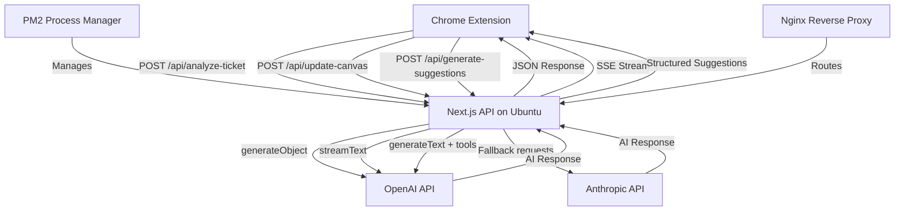

# Design Document

## Overview

The QA ChatCanvas Interactive backend is a Next.js API application that serves as the AI-powered engine for processing Jira ticket data and providing conversational capabilities for QA documentation generation. The system leverages Vercel AI SDK v5 to provide three core API endpoints that enable real-time collaboration between QA analysts and AI through a Chrome extension frontend.

The architecture follows a "client-server with direct AI integration" pattern, where the backend acts as an intelligent middleware between the Chrome extension and LLM providers, with direct API integration to OpenAI and Anthropic services.

## Architecture

### System Architecture

The system consists of three main layers:

1. **Chrome Extension Frontend** (External): Handles Jira data scraping, user interface, and local state management
2. **Next.js Backend API** (This Project): Processes AI requests, manages conversation flow, and generates structured QA documentation
3. **LLM Providers** (External): Direct integration with OpenAI and Anthropic APIs for AI processing

### Deployment Architecture

- **Server**: Ubuntu 22.04 LTS
- **Process Manager**: PM2 for production process management
- **Runtime**: Node.js with Next.js standalone build
- **Reverse Proxy**: Nginx (recommended) for SSL termination and load balancing
- **Environment Management**: PM2 ecosystem file for environment variables and process configuration

### Technology Stack

- **Framework**: Next.js 14+ with App Router
- **AI SDK**: Vercel AI SDK v5
- **Deployment**: Ubuntu 22 Server with PM2
- **Process Manager**: PM2 for production deployment
- **AI Providers**: Direct integration with OpenAI (primary), Anthropic (secondary)
- **Validation**: Zod for schema validation
- **Environment**: Node.js production environment

### Data Flow Architecture



### Message Flow Pattern

The system implements the Vercel AI SDK v5 message transformation pipeline:

1. **Frontend to Backend**: UIMessage[] → API Request
2. **Backend Processing**: UIMessage[] → convertToModelMessages() → ModelMessage[]
3. **AI Interaction**: ModelMessage[] → LLM → AI Response
4. **Backend to Frontend**: AI Response → toUIMessageStreamResponse() → SSE Stream

## Components and Interfaces

### Core API Endpoints

#### 1. POST /api/analyze-ticket

- **Purpose**: Initial ticket analysis and QA document generation
- **Method**: Transactional (non-streaming)
- **AI Function**: `generateObject` with `QACanvasDocumentSchema`
- **Input**: `TicketAnalysisPayload`
- **Output**: `QACanvasDocument`

#### 2. POST /api/update-canvas

- **Purpose**: Conversational refinement of QA documentation
- **Method**: Streaming
- **AI Function**: `streamText` with conversation history
- **Input**: `UIMessage[]` (chat history)
- **Output**: SSE stream of `UIMessageStreamParts`

#### 3. POST /api/generate-suggestions

- **Purpose**: Generate contextual QA improvement suggestions
- **Method**: Tool-based structured generation
- **AI Function**: `generateText` with `qaSuggestionTool`
- **Input**: Current document context
- **Output**: Array of structured `QASuggestion` objects

### Data Schemas

#### TicketAnalysisPayload

```typescript
{
  qaProfile: {
    qaCategories: {
      functional: boolean,
      ux: boolean,
      ui: boolean,
      negative: boolean,
      api: boolean,
      database: boolean,
      performance: boolean,
      security: boolean,
      mobile: boolean,
      accessibility: boolean
    },
    testCaseFormat: "gherkin" | "steps" | "table"
  },
  ticketJson: {
    // Jira ticket data structure
    title: string,
    description: string,
    acceptanceCriteria?: string,
    comments?: Comment[],
    // ... other Jira fields
  }
}
```

#### QACanvasDocument

```typescript
{
  ticketSummary: {
    problem: string,
    solution: string,
    context: string
  },
  configurationWarnings?: Warning[],
  acceptanceCriteria: AcceptanceCriterion[],
  testCases: TestCase[],
  metadata: {
    generatedAt: string,
    qaProfile: QAProfile,
    ticketId: string
  }
}
```

#### QASuggestion

```typescript
{
  suggestionType: "edge_case" | "ui_verification" | "functional_test" | "clarification_question",
  description: string,
  targetSection?: string,
  priority: "high" | "medium" | "low"
}
```

### AI Tools Definition

#### qaSuggestionTool

```typescript
const qaSuggestionTool = tool({
  description:
    "Propose a single, actionable QA suggestion to improve the test plan.",
  parameters: z.object({
    suggestionType: z.enum([
      "edge_case",
      "ui_verification",
      "functional_test",
      "clarification_question",
    ]),
    description: z.string().describe("Detailed suggestion text"),
    targetSection: z.string().optional().describe("Specific document section"),
    priority: z.enum(["high", "medium", "low"]).default("medium"),
  }),
});
```

## Data Models

### Message Transformation Pipeline

The system strictly follows Vercel AI SDK v5 message handling patterns:

1. **UIMessage Structure**:

   - `id`: Stable identifier for message persistence
   - `role`: "user" | "assistant" | "system"
   - `parts`: Array of UIMessagePart (text, data, tool calls)
   - `metadata`: Application-specific data (not sent to LLM)

2. **ModelMessage Structure**:

   - Simplified format optimized for LLM consumption
   - Generated via `convertToModelMessages(uiMessages)`
   - Strips metadata and UI-specific information

3. **Streaming Response**:
   - Uses `toUIMessageStreamResponse()` for SSE formatting
   - Sends `UIMessageStreamParts` for real-time updates
   - Compatible with frontend `useChat` hook

### Document Generation Logic

#### Intelligent Structure Algorithm

1. **Ticket Analysis Phase**:

   - Extract and simplify technical jargon
   - Identify problem, solution, and context
   - Generate plain-language explanation

2. **Configuration Validation Phase**:

   - Compare ticket requirements vs. QA categories
   - Generate warnings for conflicts (e.g., API testing needed but disabled)
   - Provide specific recommendations

3. **Content Generation Phase**:

   - Generate acceptance criteria based on ticket content
   - Create test cases in specified format (Gherkin/steps/table)
   - Apply QA category filters to focus content

4. **Quality Assurance Phase**:
   - Validate generated content against schema
   - Ensure completeness and coherence
   - Apply final formatting and structure

## Error Handling

### Error Categories and Responses

#### 1. Validation Errors (400)

```typescript
{
  error: "VALIDATION_ERROR",
  message: "Invalid request payload",
  details: {
    field: "qaProfile.testCaseFormat",
    expected: "gherkin | steps | table",
    received: "invalid_format"
  }
}
```

#### 2. AI Processing Errors (500)

```typescript
{
  error: "AI_PROCESSING_ERROR",
  message: "Failed to generate QA document",
  details: {
    provider: "openai",
    model: "gpt-4o",
    retryable: true
  }
}
```

#### 3. Rate Limiting (429)

```typescript
{
  error: "RATE_LIMIT_EXCEEDED",
  message: "Too many requests",
  retryAfter: 60
}
```

### Graceful Degradation Strategy

1. **Provider Failover**: Manual switching between OpenAI and Anthropic with retry logic and error handling
2. **Partial Content**: Return partial results with warnings when full generation fails
3. **Assumption Documentation**: When AI makes assumptions, clearly communicate them in responses
4. **Recovery Suggestions**: Provide actionable next steps for error resolution
5. **Circuit Breaker**: Implement circuit breaker pattern for provider failures to prevent cascading issues

### AI Uncertainty Handling

When the AI encounters ambiguous requests:

1. **Try-Verify-Feedback Pattern**:

   - Generate best-guess interpretation
   - Include assumption explanation in response
   - Request user confirmation or correction

2. **Structured Clarification**:
   - Generate specific clarifying questions
   - Provide multiple interpretation options
   - Maintain conversation context for follow-up

## Testing Strategy

### Unit Testing

- **Schema Validation**: Test all Zod schemas with valid/invalid inputs
- **Message Transformation**: Verify UIMessage ↔ ModelMessage conversion
- **Error Handling**: Test all error scenarios and response formats
- **AI Tool Definitions**: Validate tool parameter schemas and descriptions

### Integration Testing

- **API Endpoints**: Test complete request/response cycles
- **AI SDK Integration**: Mock AI responses to test data flow
- **Streaming Functionality**: Verify SSE stream formatting and consumption
- **Error Propagation**: Test error handling across the full stack

### End-to-End Testing

- **Complete Workflows**: Test full ticket analysis → refinement → suggestions flow
- **Provider Failover**: Test direct API failover scenarios between OpenAI and Anthropic
- **Performance**: Load testing for concurrent requests and streaming responses
- **Data Consistency**: Verify document coherence across multiple refinement iterations
- **PM2 Integration**: Test process management, restart scenarios, and environment variable handling

### Testing Tools and Framework

- **Jest**: Unit and integration testing
- **Supertest**: API endpoint testing
- **MSW (Mock Service Worker)**: AI provider mocking
- **PM2 Testing**: Local PM2 environment for deployment testing
- **Docker**: Containerized testing environment matching Ubuntu 22 production

### Test Data Strategy

- **Synthetic Jira Tickets**: Create representative test tickets covering various scenarios
- **QA Profile Variations**: Test different combinations of categories and formats
- **Edge Cases**: Test malformed data, missing fields, and boundary conditions
- **Conversation Flows**: Test multi-turn chat scenarios with context preservation
